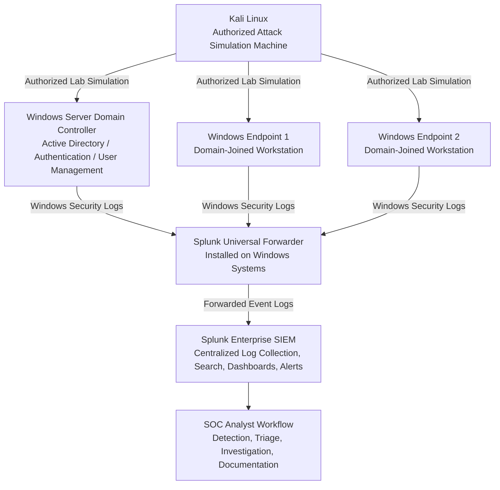
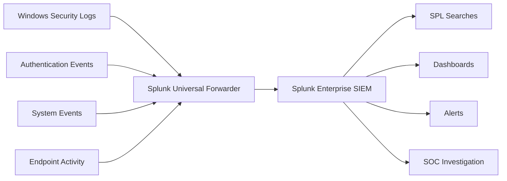
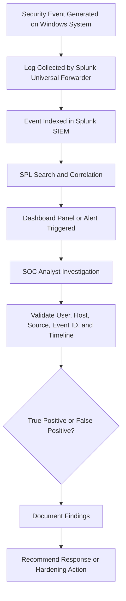

# AD Sentinel: Splunk-Based Active Directory Detection Lab
Active Directory Attack Detection and SIEM Monitoring Lab using Splunk to collect Windows security logs, monitor authentication activity, and detect lab-simulated attacks like brute force, LLMNR poisoning, Kerberoasting, credential dumping, and lateral movement.

## Project Overview

The **AD Sentinel: Splunk-Based Active Directory Detection Lab** is a hands-on cybersecurity project designed to simulate, detect, and investigate suspicious activity in a Windows Active Directory environment using **Splunk SIEM**.

This lab was built to understand how common Active Directory attack techniques generate security telemetry and how SOC analysts can use Windows Event Logs, authentication logs, endpoint activity, and SIEM-based searches to identify potential threats.

The project focuses on practical SOC Analyst skills, including centralized log collection, Windows Event Log analysis, Splunk search development, dashboard creation, alert logic building, and investigation workflow documentation.

All activities were performed inside an isolated and authorized lab environment for educational, defensive security, and portfolio development purposes.

---

## Lab Architecture

---

## Log Collection Flow

---

## Lab Components

| Component                            | Role in the Lab                                                                                       | Security Value                                                                                                        |
| ------------------------------------ | ----------------------------------------------------------------------------------------------------- | --------------------------------------------------------------------------------------------------------------------- |
| **Windows Server Domain Controller** | Hosts Active Directory Domain Services and manages authentication, users, groups, and domain policies | Provides core AD telemetry such as logon events, Kerberos activity, account changes, and privileged access indicators |
| **Windows Endpoint 1**               | Domain-joined workstation used for user activity and endpoint log generation                          | Helps monitor workstation-level authentication, process activity, and suspicious endpoint behavior                    |
| **Windows Endpoint 2**               | Additional domain-joined workstation used for movement and activity simulation                        | Supports detection of endpoint-to-endpoint access patterns and lateral movement indicators                            |
| **Kali Linux Machine**               | Authorized attacker simulation system used only inside the isolated lab                               | Generates controlled attack-related activity for detection and investigation practice                                 |
| **Splunk Universal Forwarder**       | Installed on Windows systems to forward event logs to Splunk                                          | Enables centralized collection of Windows Security, System, and endpoint logs                                         |
| **Splunk Enterprise SIEM**           | Central platform for log search, dashboards, alerting, and investigation                              | Provides SOC-style visibility, detection logic, and investigation capability                                          |

---

## Key Objectives

* Build a realistic Active Directory security monitoring lab.
* Configure centralized Windows log collection using Splunk Universal Forwarder.
* Collect and analyze Windows Security, System, authentication, and endpoint-related events.
* Monitor failed logins, successful logins, privileged access, and suspicious authentication behavior.
* Simulate common Active Directory attack scenarios in a controlled and authorized lab environment.
* Create Splunk searches for detecting suspicious Windows and Active Directory activity.
* Build dashboards and alerts for SOC-style monitoring.
* Practice investigation workflows used by SOC Analyst L1/L2 teams.
* Document findings in a professional, portfolio-ready format.

---

## Simulated Attack Scenarios

The following scenarios were simulated only inside an isolated and authorized lab environment:

| Scenario                                            | Purpose                                                                                     |
| --------------------------------------------------- | ------------------------------------------------------------------------------------------- |
| **Brute-Force Login Attempts**                      | To observe repeated failed authentication events and identify suspicious login patterns     |
| **LLMNR Poisoning Activity**                        | To understand how name resolution abuse may appear during investigation                     |
| **Kerberoasting Indicators**                        | To monitor Kerberos service ticket request behavior and identify suspicious ticket activity |
| **Credential Dumping Simulation**                   | To study endpoint and authentication-related indicators linked to credential abuse          |
| **Lateral Movement Attempts**                       | To observe suspicious authentication between domain-joined systems                          |
| **Suspicious Authentication Behavior**              | To detect unusual login patterns, logon types, and account activity                         |
| **Successful Login After Multiple Failed Attempts** | To identify possible successful compromise after repeated authentication failures           |

> No real-world exploitation was performed. All simulations were limited to an authorized lab environment.

---

## Detection Use Cases

| Detection Use Case                         | Description                                                                                  | Relevant Windows Event IDs |
| ------------------------------------------ | -------------------------------------------------------------------------------------------- | -------------------------- |
| **Multiple Failed Login Attempts**         | Detects repeated failed authentication attempts from the same account or source system       | 4625, 4771, 4776           |
| **Successful Login After Failed Attempts** | Identifies successful authentication following multiple failed login attempts                | 4624, 4625                 |
| **Suspicious Logon Types**                 | Reviews logon types that may indicate remote access, service logons, or lateral movement     | 4624, 4625                 |
| **Privileged Account Logon**               | Detects accounts receiving special privileges during logon                                   | 4672, 4624                 |
| **Kerberos Service Ticket Activity**       | Monitors Kerberos service ticket requests that may indicate abnormal service access behavior | 4768, 4769, 4771           |
| **Possible Credential Abuse**              | Identifies unusual authentication patterns, repeated failures, or abnormal account usage     | 4624, 4625, 4672, 4776     |
| **Lateral Movement Indicators**            | Detects authentication activity between internal domain-joined systems                       | 4624, 4625, 4672           |
| **Suspicious Process Execution**           | Reviews process creation events that may support endpoint investigation                      | 4688                       |

---

## Important Windows Event IDs Monitored

| Event ID | Event Name                                   | Why It Matters                                                                                        |
| -------- | -------------------------------------------- | ----------------------------------------------------------------------------------------------------- |
| **4624** | Successful Logon                             | Shows successful authentication activity and helps identify user, host, logon type, and source system |
| **4625** | Failed Logon                                 | Useful for detecting brute-force attempts, password guessing, and failed access attempts              |
| **4672** | Special Privileges Assigned to New Logon     | Helps identify privileged account activity and administrative logons                                  |
| **4688** | Process Creation                             | Supports endpoint investigation by showing process execution activity                                 |
| **4720** | User Account Created                         | Helps detect unauthorized or suspicious account creation                                              |
| **4726** | User Account Deleted                         | Useful for tracking account removal and possible defense evasion                                      |
| **4732** | Member Added to Security-Enabled Local Group | Helps identify privilege escalation or unauthorized group membership changes                          |
| **4768** | Kerberos Authentication Ticket Requested     | Shows Kerberos ticket-granting ticket activity                                                        |
| **4769** | Kerberos Service Ticket Requested            | Important for monitoring service ticket activity and Kerberos-based attack indicators                 |
| **4771** | Kerberos Pre-Authentication Failed           | Useful for detecting failed Kerberos authentication attempts                                          |
| **4776** | NTLM Authentication Attempt                  | Helps monitor NTLM-based authentication behavior                                                      |

---

## SOC Investigation Workflow

---

## Dashboards Created

The Splunk dashboard was designed to support SOC-style monitoring and investigation.

Dashboard panels include:

* Failed Login Overview
* Successful Login Overview
* Top Failed Login Users
* Top Source Hosts
* Authentication Activity Timeline
* Kerberos Authentication Events
* Privileged Logon Events
* Suspicious Logon Types
* Endpoint Activity Overview
* Attack Timeline View

---

## Skills Demonstrated

* Active Directory security monitoring
* Windows Event Log analysis
* Splunk SIEM investigation
* Splunk Universal Forwarder configuration
* SPL search development
* Dashboard creation in Splunk
* Authentication event analysis
* Kerberos monitoring basics
* Brute-force detection logic
* Credential abuse investigation
* Lateral movement detection concepts
* Endpoint activity analysis
* SOC alert triage workflow
* Incident investigation documentation
* Defensive security lab building

---

## Tools and Technologies Used

| Tool / Technology                    | Purpose                                                                         |
| ------------------------------------ | ------------------------------------------------------------------------------- |
| **Windows Server**                   | Used as the Domain Controller for Active Directory services                     |
| **Windows 10/11 Endpoints**          | Domain-joined workstations used for endpoint monitoring and log generation      |
| **Active Directory Domain Services** | Provides domain authentication, user management, and group policy functionality |
| **Kali Linux**                       | Used as an authorized lab machine for controlled attack simulation              |
| **Splunk Enterprise**                | SIEM platform used for log search, dashboards, alerting, and investigation      |
| **Splunk Universal Forwarder**       | Collects and forwards Windows logs from lab systems to Splunk                   |
| **Windows Event Viewer**             | Used to validate local Windows events before SIEM analysis                      |
| **PowerShell**                       | Used for Windows administration and log validation                              |
| **Windows Security Logs**            | Primary telemetry source for authentication and security event monitoring       |

---

## Project Outcome

This project demonstrates how a SOC analyst can monitor a Windows Active Directory environment using Splunk SIEM and Windows Event Logs.

Through this lab, I practiced collecting Windows security telemetry, analyzing authentication activity, identifying suspicious logon behavior, monitoring Kerberos-related events, building detection searches, and creating dashboards for investigation.

The project helped strengthen practical skills in:

* SIEM monitoring
* Active Directory security fundamentals
* Windows authentication analysis
* Event ID-based investigation
* Splunk SPL searching
* SOC alert triage
* Defensive detection engineering basics

This lab is useful for SOC Analyst L1/L2 preparation, cybersecurity portfolio development, and understanding how common Active Directory attack indicators can be detected in a controlled environment.

---
## 📚 Documentation

The project documentation is organized to explain the lab setup, architecture, detection logic, and investigation workflow.

| Document                       | Description                                                                                                                                                                |
| ------------------------------ | -------------------------------------------------------------------------------------------------------------------------------------------------------------------------- |
| **Lab Setup Guide**            | Step-by-step instructions for building the Active Directory lab, configuring Windows systems, installing Splunk Enterprise, and setting up Splunk Universal Forwarder      |
| **Architecture Diagram**       | Visual representation of the lab network, Active Directory structure, log forwarding flow, and SIEM monitoring process                                                     |
| **Detection Use Cases**        | Detection scenarios created for failed logins, suspicious authentication, Kerberos activity, privileged logons, credential abuse indicators, and lateral movement behavior |
| **SPL Detection Queries**      | Defensive Splunk searches used to identify suspicious Windows and Active Directory activity                                                                                |
| **SOC Investigation Workflow** | Analyst workflow for reviewing alerts, validating evidence, checking Windows Event IDs, and documenting findings                                                           |
| **Detection Coverage Matrix**  | Mapping of detection use cases to relevant Windows Event IDs and MITRE ATT&CK techniques                                                                                   |
| **Attack Simulation Overview** | High-level summary of authorized lab simulations used to generate security events for detection testing                                                                    |

> Note: The attack simulation documentation is written from a defensive and educational perspective. It does not include instructions for unauthorized activity.

---

## ⚠️ Disclaimer

This project was created strictly for educational, defensive security, and SOC Analyst training purposes.

All simulations were performed inside an isolated and authorized lab environment. The techniques, detections, and workflows documented in this repository are intended to help understand Active Directory security monitoring, Windows Event Log analysis, Splunk SIEM investigation, and incident response fundamentals.

Do not use any technique, tool, or procedure against systems you do not own or do not have explicit permission to test. Unauthorized access to computer systems, networks, or data is illegal.

---

## 📄 License

This project is licensed under the **MIT License**.

See the `https://github.com/nothingnhm/AD-Sentinel-Splunk-Based-Active-Directory-Detection-Lab/blob/main/LICENSE` file for more details.

---

## 👤 Author

**Ananda Das**
Cybersecurity Student | SOC Analyst Learner | Active Directory & SIEM Lab Builder

GitHub: `@nothingnhm`
Project: **AD Sentinel: Splunk-Based Active Directory Detection Lab**
